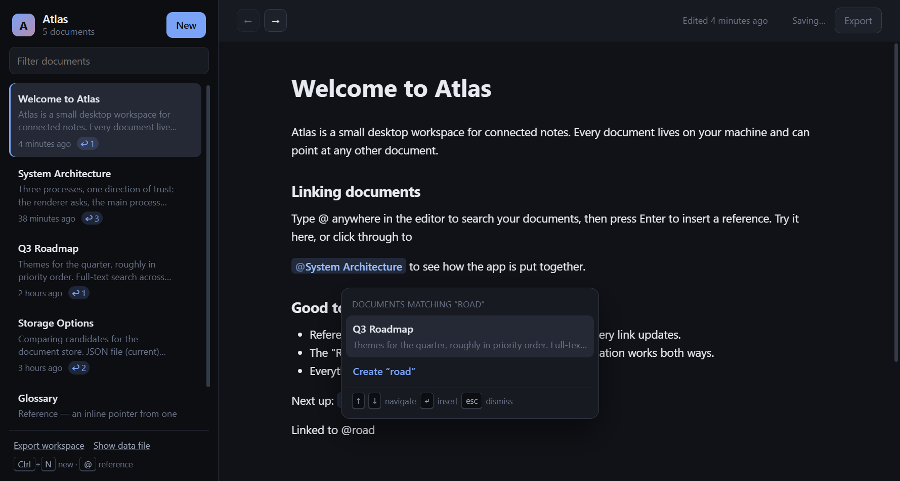
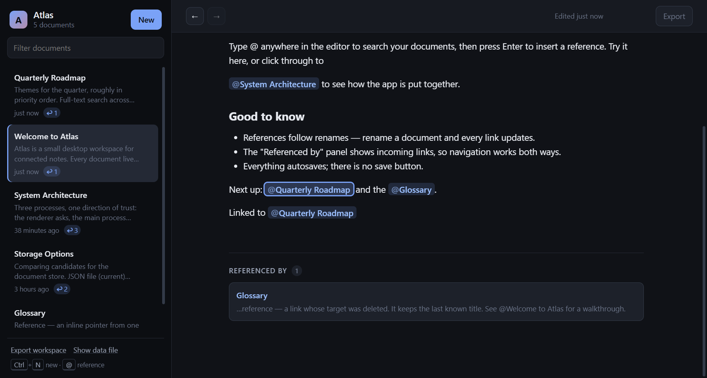

# Atlas

A desktop document workspace built with Electron, React and TypeScript. Documents live locally, are edited in a rich-text editor, and can reference each other with `@` mentions — type `@`, search, insert, and click the reference to navigate.



## Running it

```bash
npm install
npm run dev        # Vite dev server + Electron with HMR
```

| Script | What it does |
| --- | --- |
| `npm run dev` | Development app with hot reload |
| `npm run typecheck` | Type-checks the Node and web projects separately |
| `npm run test` | Unit tests (Vitest) for the rich-text, storage and export logic |
| `npm run build` | Typecheck, then bundle main, preload and renderer |
| `npm run smoke` | Builds, then drives the real app with Playwright (11 end-to-end checks) |
| `npm run verify` | Typecheck, unit tests and smoke test in one go |
| `npm run dist` | Produces an installer via electron-builder |

On first launch the workspace is seeded with five cross-referencing documents so the feature is visible immediately.

## What it does

- **Document list** with excerpt, relative timestamp and an incoming-reference count.
- **Rich-text editing** (headings, lists, quotes, code, marks) with autosave — no save button.
- **`@` mentions**: debounced search over titles, initials and body text, keyboard-driven selection, and a "Create *…*" option that makes a new document and links it in one step.
- **Navigation**: click a reference to open the target, with back/forward history (`Alt+←` / `Alt+→`).
- **Backlinks**: every document shows what points at it, with surrounding context.
- **Rename-safe links**: renaming a document updates every reference to it, everywhere.
- **Unresolved references**: deleting a document leaves its references intact but visibly broken, keeping the last known title, rather than silently rewriting other people's documents.
- **Undoable deletion**: deleting offers an undo instead of asking for confirmation, and restoring puts the document back under its original id so every reference resolves again.
- **Markdown export**: one document, or the whole workspace as a folder of files that link to each other.



## Architecture

```
src/
  shared/      types + rich-text helpers used by every process
  main/        document repository, link index, Markdown export, IPC handlers
  preload/     contextBridge surface (the only path across the boundary)
  renderer/    React UI, Tiptap editor, workspace store
scripts/       Playwright smoke test
```

Data flows in one direction: the renderer asks, the main process decides.

```
React components ──▶ workspaceStore ──▶ window.api ──▶ preload ──▶ ipcMain ──▶ DocumentRepository
       ▲                                                                              │
       └──────────────────── state patch ◀────────────── resolved IPC response ◀───────┘
```

### Key decisions

**References store an id, not a title.** A mention is an atomic inline node whose attributes are `{ docId, label }`. `docId` is the truth; `label` is only a cached fallback. Everything good follows from this: renames propagate for free, a backlink index is exact rather than string-matched, and a deleted target degrades into a clearly unresolved link. Node views resolve the *live* title from workspace state at render time, so a rename shows up in open documents immediately.

**The main process owns storage, search and the link index.** The renderer never touches the filesystem, so `contextIsolation`, `sandbox` and `nodeIntegration: false` all stay at their safe defaults and the preload exposes a fixed set of operations rather than `ipcRenderer` itself. Arguments are validated at the IPC boundary instead of trusted.

**The main process knows nothing about Tiptap.** Content crosses the boundary as a structural `RichTextNode` tree. Storage, search, plain-text extraction and the link index all work on that shape, so swapping the editor would not touch the backend.

**JSON file over SQLite.** One atomically written file (`documents.json` in `userData`, tmp file + rename, debounced) means no native modules and no rebuild-per-Electron-version, and it is trivial to inspect or back up — the sidebar has a "Show data file" link. The tradeoff is that the whole workspace is held in memory and search is a linear scan; that is comfortable into the low thousands of documents, after which SQLite with FTS5 is the natural move. The repository is a single class with a narrow interface precisely so that swap stays cheap.

**Search runs in main, filtering runs in the renderer.** The `@` menu queries the main process because scoring needs document bodies. The sidebar filter only ever touches summaries the renderer already has, so typing there costs nothing.

**One observable store, not context.** `workspaceStore` is a plain observable consumed through `useSyncExternalStore`. Tiptap node views and the suggestion plugin render outside the normal component tree, and a module-level store lets them read titles and trigger navigation without threading context through the editor. Components subscribe with selectors so a keystroke does not re-render the sidebar.

**The editor layer is dependency-injected.** `createMentionSuggestion({ search, createDocument, navigate })` and `DocumentMention.configure({ navigate })` keep the Tiptap code free of store imports; `App` wires the two together. It also makes the mention behaviour testable without an Electron window.

**Undo instead of a confirmation dialog.** A prompt taxes every deliberate deletion to guard against the rare misclick; an undo offer does the opposite. The repository keeps deleted records in an in-memory bin and restores them under their original id, which is the only reason references can come back to life — a restore that minted a new id would leave every mention permanently broken. The bin is session-scoped: surviving a restart would mean persisting deleted content, which is a different feature (a trash folder) with its own expectations.

**The link index is derived from content, not from existence.** Deleting a document removes its outgoing edges but leaves the incoming ones, because other documents genuinely still contain those references. That keeps the index a pure function of stored content, makes "unresolved" the honest description of the state, and makes restoring a document an O(1) operation instead of a full reindex.

**Export writes a folder, not a file.** "References rendered as links" only means something if the link targets exist, so a workspace export emits one file per document with deterministic slugs (collisions get a numeric suffix), relative `[Title](./slug.md)` links between them, and an `index.md`. References whose target is gone — or is not part of a single-document export — degrade to plain `@Title` text rather than dangling links. The Markdown converter is a pure function of the content tree, which is why it is the easiest part of the app to test.

**Two levels of debounce.** Edits coalesce for 400 ms in the renderer before an IPC round trip, then writes coalesce again for 250 ms in the repository before touching the disk. Pending work is flushed on navigation, on delete, on window blur, and on `before-quit`, so nothing is lost between the last keystroke and quitting.

### Edge cases worth calling out

- Navigating mid-edit flushes the pending patch first, and patches carry their own document id, so a save can never land on the wrong document.
- A slow `get` cannot overwrite a newer navigation — loads are guarded by a token.
- Save requests are chained rather than fired in parallel, so out-of-order writes cannot resurrect stale content.
- A corrupt or missing store file falls back to seed content instead of crashing on launch.
- Self-references are excluded from both the `@` menu and the link index.
- The editor remounts per document, so undo history never leaks across documents.

## Testing

Two layers, split by what each is good at.

**Unit tests** (`npm run test`, 61 tests) cover the logic that is pure or file-backed, where exhaustive cases are cheap: rich-text traversal and relabelling, the repository against a temp directory (seeding, corrupt-file recovery, persistence round trips, the backlink index, rename propagation, delete/restore ordering, search ranking), the Markdown converter, and the export writer.

**A smoke test** (`npm run smoke`, 11 checks) drives the real application with Playwright in a throwaway `userData` directory, because the interesting risk in the UI is integration, not logic: seeding, clicking a reference, back navigation, `@` search, insertion, backlink appearance, rename propagation, undoing a deletion, and an export (with the native save dialog stubbed in the main process) whose output is read back off disk.

Both layers earned their keep. The repository tests caught a restored document coming back with no incoming references, and the smoke test caught the `@` menu inserting the wrong item: the popup can open under a resting mouse pointer, `mouseenter` then fired on whatever option landed under it, and the keyboard highlight moved — so pressing Enter chose a neighbour. Highlighting on `mousemove` fixes it, and both tests now assert against a regression.

## If I kept going

- Full-text search across the workspace, and a quick-open palette — the scoring function already exists.
- Move to SQLite + FTS5 once workspaces get large; the repository interface is the seam.
- A persistent trash folder, so deletions survive a restart rather than only the session.
- Markdown *import*, which is mostly the converter run backwards, plus resolving `[[wiki links]]` to ids.
- Multi-window support would need the main process to broadcast change events; today the renderer is the single reader of its own writes.
